# E-Banking App - Angular Frontend (Groupe 4)

Ce projet représente l'interface utilisateur pour une application de gestion bancaire. Il a été développé en Angular et intègre diverses fonctionnalités pour gérer les clients, les comptes, et les opérations bancaires, tout en offrant une expérience utilisateur fluide et efficace.

## Fonctionnalités principales

### 1. Authentification
- Autres fonctionnalités pour enrichir l'application selon les besoins futurs.
- 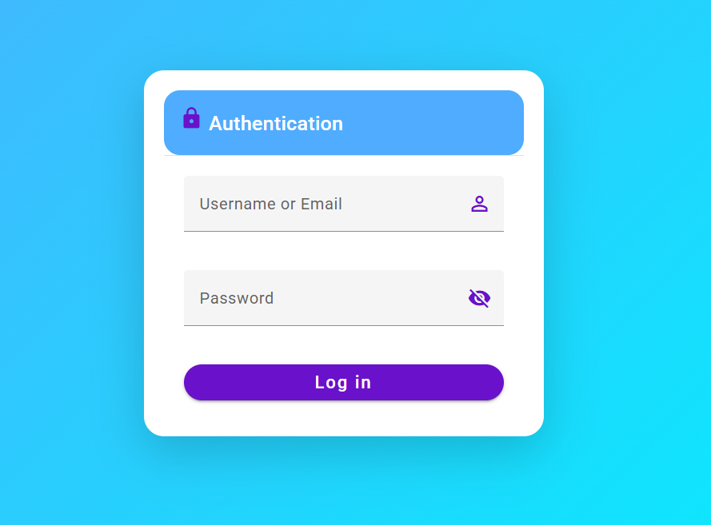

### 2. Dashboard interactif
- Création d'un tableau de bord dynamique en utilisant **ChartJS** (ng-chart).
- Affichage de graphiques et de statistiques utiles pour aider à la prise de décision.
- 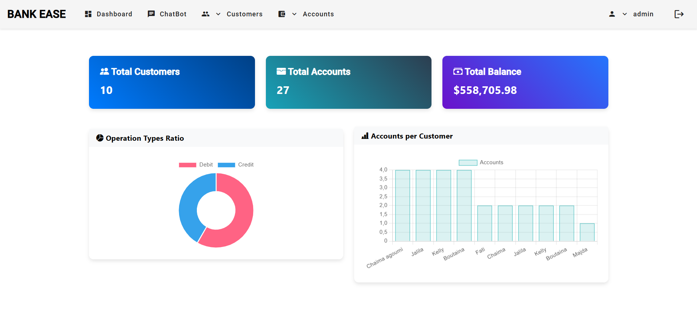

### 3. Chatbot
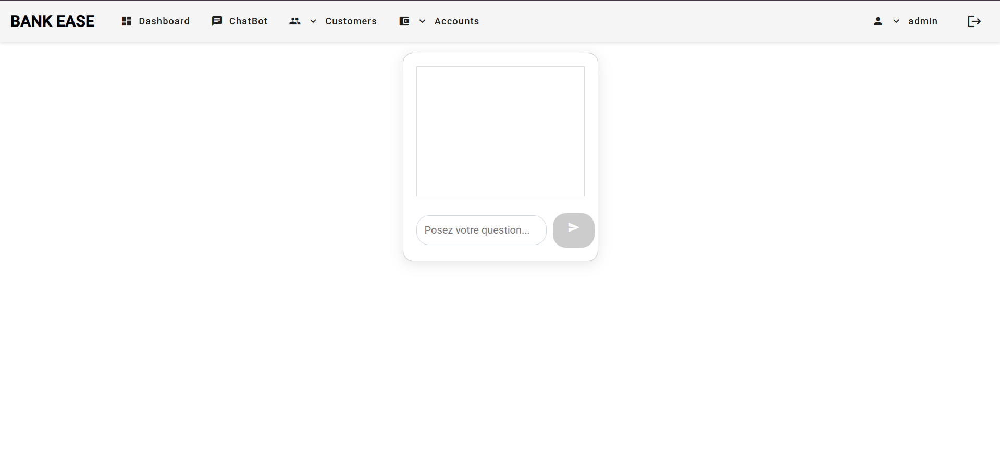

### 4. Gestion des clients
- Ajout de nouveaux clients.
- 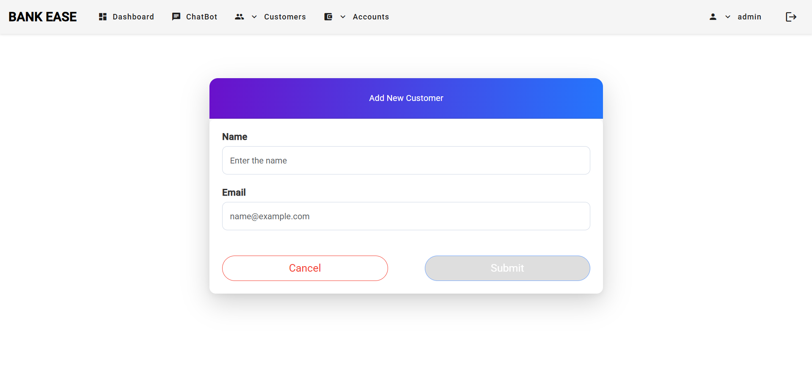
- Suppression de clients existants.
- 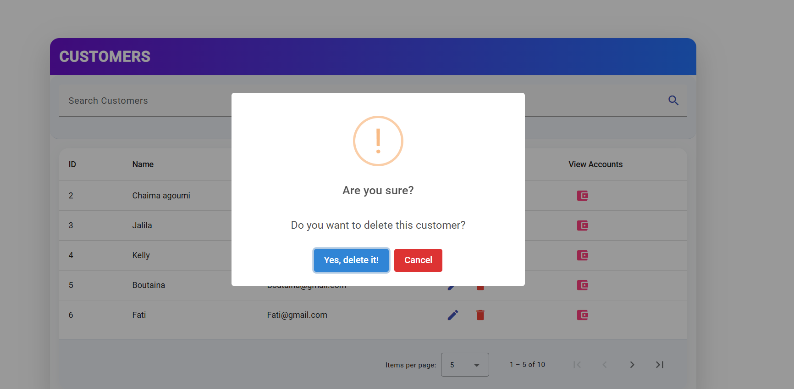
- Édition des informations des clients.
- 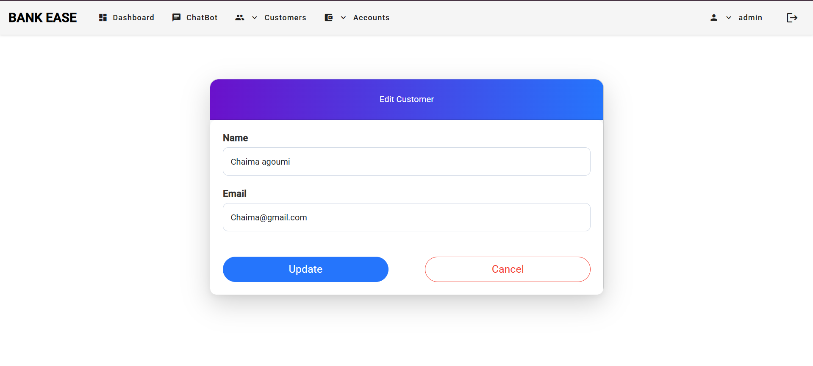
- Recherche avancée des clients.
- 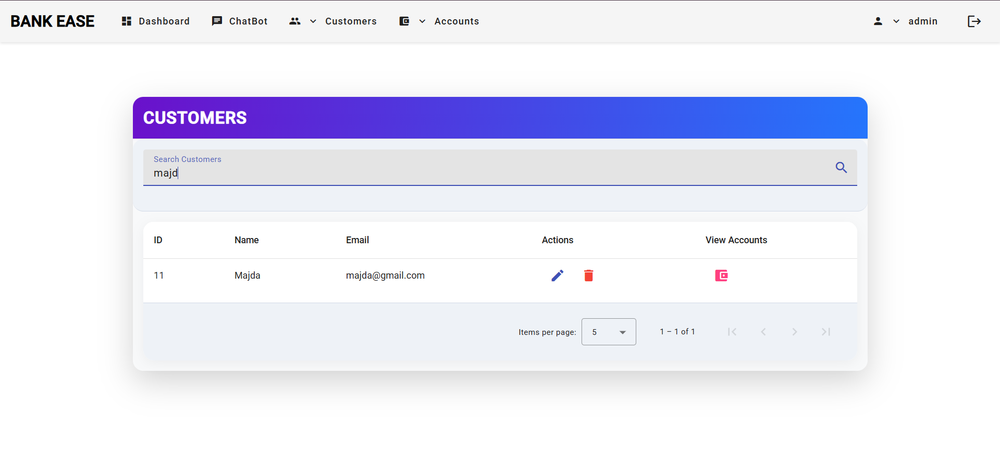
- Consultation de la liste des comptes par clients.
- 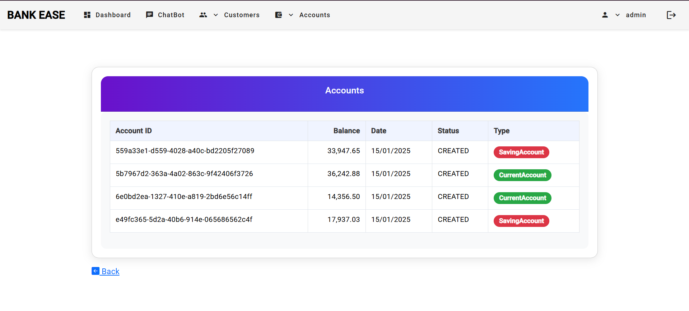

### 5. Gestion des comptes
- Création et ajout de nouveaux comptes bancaires.
- 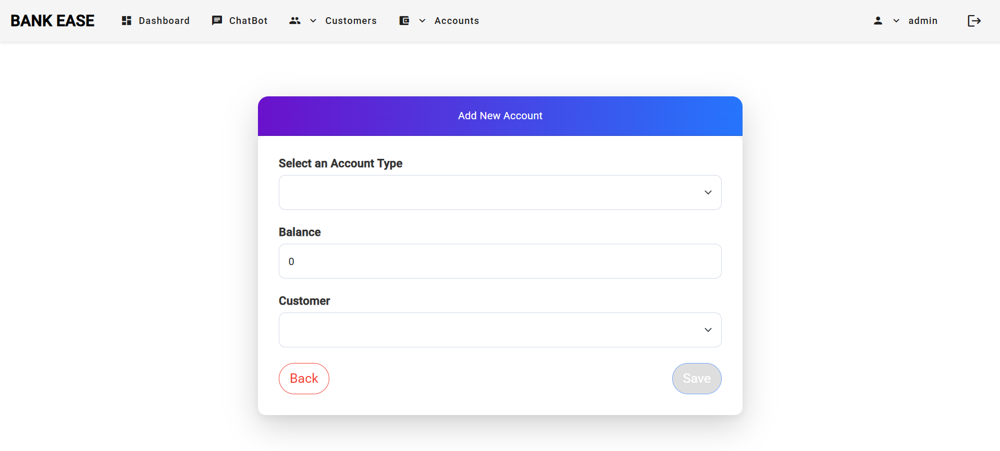
- Recherche et consultation des comptes existants.
- 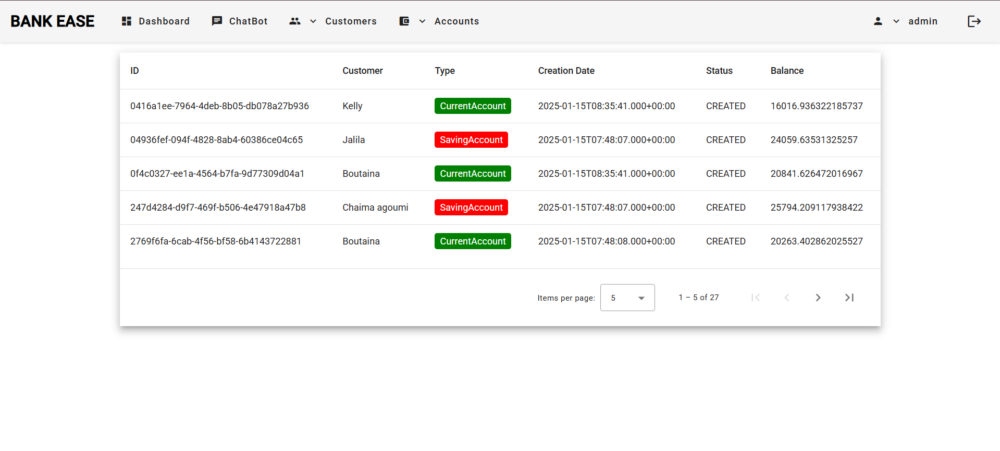
- 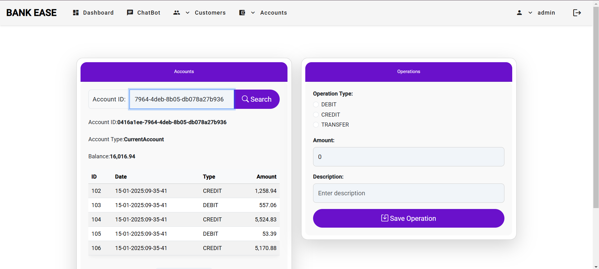

### 6. Gestion des comptes et mots de passe
- Possibilité pour les utilisateurs de changer leur mot de passe via l'application.
- 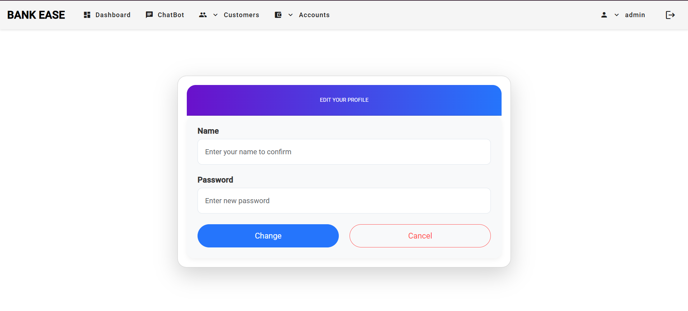

## Prérequis

- **Node.js** : Version 16 ou supérieure
- **Angular CLI** : Version 15 ou supérieure
- **IDE** : Intellij IDEA

## Installation et Lancement

1. Clonez le dépôt :
   ```bash
   git clone https://github.com/Chaaamah/E-Banking-App-Angular-Frontend-G4.git
   ```
2. Accédez au dossier du projet :
   ```bash
   cd E-Banking-App-Angular-Frontend-G4
   ```
3. Installez les dépendances :
   ```bash
   npm install
   ```
4. Lancez le serveur de développement :
   ```bash
   ng serve
   ```
5. Accédez à l'application via [http://localhost:4200](http://localhost:4200).

## Structure du projet

- `src/app`
  - Contient les composants principaux de l'application.
- `src/environments`
  - Contient les configurations pour les différents environnements (développement et production).

## Membres du projet

- Chaima AGOUMI
- BACHRI Fatima Ezzahra
- BOUANGA Nelle Kelly
- Jalila BIZALINE
- ER-RAGRAGY Boutaina
- Safaa FEKNI

## Licence

Ce projet est réalisé dans le cadre académique et n'est pas destiné à une utilisation commerciale.
